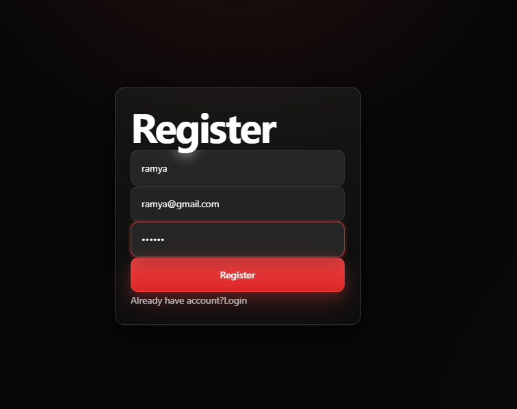
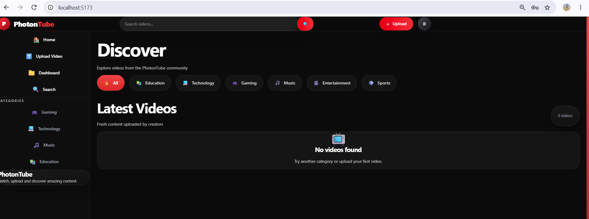
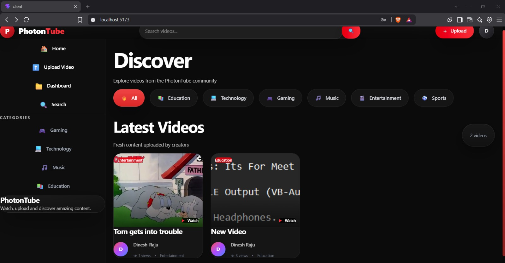
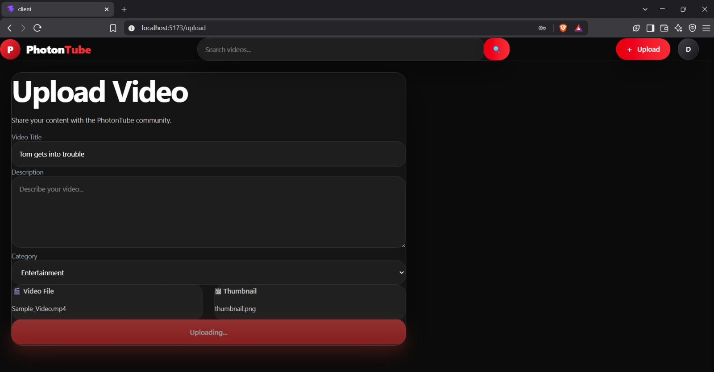

Absolutely. Here is the **full updated `README.md`** for your **Video Streaming Platform**, using the **exact screenshot filenames** you showed:

* `Register.png`
* `dashboard.png`
* `latest_videos.jpeg`
* `upload.jpeg`

The screenshot paths are also set correctly so the images should appear **directly on GitHub**.

````markdown
# 🎬 Video Streaming Platform

A modern and responsive **Video Streaming Platform** developed as part of the **CodTech IT Solutions Internship**. The application provides users with an interactive platform to browse, explore, and access video content through a clean and user-friendly interface.

---

# 📋 Project Information

| Field | Details |
|-------|---------|
| **Intern ID** | CITS4882 |
| **Full Name** | Bammidi Ramya Jyothi |
| **Project Name** | Video Streaming Platform |
| **Project Scope** | Full Stack Web Development |
| **Duration** | 8 Weeks |
| **Organization** | CodTech IT Solutions |

---

# 📖 Project Description

The **Video Streaming Platform** is a modern web application designed to provide users with an engaging platform for browsing and accessing video content.

The application demonstrates the implementation of modern web development concepts including responsive user interface design, component-based architecture, page navigation, API integration, and organized project structure.

The platform provides different sections such as user registration, dashboard, latest videos, and content upload, creating an interactive experience for users.

---

# 🚀 Features

- 👤 User Registration
- 🏠 Interactive Dashboard
- 🎬 Video Content Browsing
- 📺 Latest Videos Section
- ⬆️ Video Upload Interface
- 🔍 Video Content Exploration
- 📱 Responsive User Interface
- 🎨 Modern and Clean UI
- ⚡ Fast Navigation
- 🔄 Dynamic Content
- 📂 Component-Based Architecture
- 🔗 API Integration

---

# 🛠️ Technology Stack

## Frontend

- React.js
- Vite
- JavaScript (ES6+)
- HTML5
- CSS3
- Axios
- React Router DOM

## Backend

- Node.js
- Express.js

## Database

- MongoDB
- Mongoose

## Version Control

- Git
- GitHub

---

# 📂 Project Structure

```text
video-streaming-platform/
│
├── backend/
│   ├── controllers/
│   ├── models/
│   ├── routes/
│   ├── middleware/
│   ├── server.js
│   └── package.json
│
├── frontend/
│   ├── src/
│   │   ├── components/
│   │   ├── pages/
│   │   ├── assets/
│   │   ├── App.jsx
│   │   └── main.jsx
│   │
│   ├── public/
│   ├── package.json
│   └── vite.config.js
│
├── screenshots/
│   ├── Register.png
│   ├── dashboard.png
│   ├── latest_videos.jpeg
│   └── upload.jpeg
│
├── documentation/
│   └── Project_Report.pdf
│
├── README.md
└── .gitignore
````

---

# ⚙️ Installation

## 1. Clone the Repository

```bash
git clone https://github.com/ramyajyothi-bammidi/video-streaming-platform.git
```

## 2. Navigate to the Project Folder

```bash
cd video-streaming-platform
```

---

## 3. Install Frontend Dependencies

```bash
cd frontend
npm install
```

---

## 4. Install Backend Dependencies

Open another terminal or navigate to the backend folder:

```bash
cd ../backend
npm install
```

---

# 🔧 Environment Variables

If the application requires environment variables, create a `.env` file inside the `backend` folder.

```env
PORT=5000
MONGO_URI=YOUR_MONGODB_CONNECTION_STRING
JWT_SECRET=YOUR_SECRET_KEY
```

> **Important:** Never upload your actual `.env` file, passwords, database credentials, or secret keys to GitHub.

---

# ▶️ Run the Project

## Start Backend

Navigate to the backend folder:

```bash
cd backend
npm run dev
```

Backend:

```text
http://localhost:5000
```

---

## Start Frontend

Open a new terminal and navigate to the frontend folder:

```bash
cd frontend
npm run dev
```

Frontend:

```text
http://localhost:5173
```

---

# 🔄 Application Workflow

The basic workflow of the application is:

```text
                    USER
                      │
                      ▼
               Registration
                      │
                      ▼
                 Dashboard
                      │
          ┌───────────┴───────────┐
          │                       │
          ▼                       ▼
    Latest Videos              Upload
          │                       │
          ▼                       ▼
   Browse Content          Upload Content
          │
          ▼
     Select Video
          │
          ▼
    Access / Watch
```

The user can register and access the main dashboard. From the dashboard, users can explore available video content through the latest videos section and access the upload functionality.

---

# 📸 Project Screenshots

The screenshots below are stored in the `screenshots` folder and are displayed directly in this README.

---

## 👤 Registration Page

The registration page provides an interface for users to enter their details and access the platform.



---

## 🏠 Dashboard

The dashboard provides the main interface of the application and allows users to navigate through the available sections and content.



---

## 🎬 Latest Videos

The latest videos section allows users to explore available video content.



---

## ⬆️ Upload Page

The upload section provides an interface for adding video content to the platform.



---

# 🎯 Learning Outcomes

During the development of this project, the following concepts were learned and implemented:

* React.js Fundamentals
* Component-Based Development
* React Router Navigation
* API Integration using Axios
* Responsive Web Design
* State Management
* Frontend Project Structure
* Backend API Development
* Node.js and Express.js
* MongoDB Database Integration
* Mongoose
* Frontend and Backend Communication
* Git & GitHub Version Control
* Debugging and Troubleshooting

---

# 🚧 Challenges Faced

During the development of this project, several challenges were encountered:

### Responsive Design

Designing a video platform that works effectively across different screen sizes required proper use of responsive layouts.

### Component Organization

Creating reusable React components required careful planning of the application structure.

### API Integration

Connecting the frontend with backend APIs required proper handling of HTTP requests and responses.

### Database Integration

Connecting the backend application with MongoDB required configuring database connections and managing data models.

### Navigation

Implementing smooth navigation between different pages required proper configuration of React Router.

### Debugging

Various frontend, backend, routing, dependency, and API-related issues were identified and resolved during development.

These challenges helped improve practical development and problem-solving skills.

---

# 🔮 Future Enhancements

The Video Streaming Platform can be further enhanced with:

* 🔐 User Authentication
* 👤 User Profiles
* 🎬 Video Upload and Management
* ❤️ Like and Dislike System
* 💬 Comment System
* ⭐ Ratings and Reviews
* 🔖 Watchlist
* 📜 Watch History
* 🔔 Real-Time Notifications
* 🔍 Advanced Search
* 🏷️ Video Categories
* 🌙 Dark Mode
* 📱 Mobile Application
* ▶️ Continue Watching
* 📺 Multiple Video Quality Options
* 🤖 Personalized Video Recommendations

---

# 📄 Documentation

The complete project documentation is available in the `documentation` folder.

```text
documentation/
└── Project_Report.pdf
```

The project report contains:

* Project Overview
* Objectives
* Technology Stack
* System Architecture
* Features
* Project Structure
* Application Workflow
* Database and API Integration
* Project Screenshots
* Challenges Faced
* Learning Outcomes
* Future Enhancements
* Conclusion
* References

---

# 🤝 Contributing

Contributions are welcome.

1. Fork the repository.
2. Create a feature branch.
3. Make your changes.
4. Commit your changes.
5. Push the branch.
6. Open a Pull Request.

---

# 📜 License

This project was developed for **educational and internship purposes** under **CodTech IT Solutions**.

---

# 👩‍💻 Author

**Bammidi Ramya Jyothi**

**Intern ID:** CITS4882

**Project Name:** Video Streaming Platform

**Project Scope:** Full Stack Web Development

**Organization:** CodTech IT Solutions

**GitHub:**
[https://github.com/ramyajyothi-bammidi](https://github.com/ramyajyothi-bammidi)

---

## ⭐ If you found this project useful, don't forget to give it a star on GitHub!

````


```

